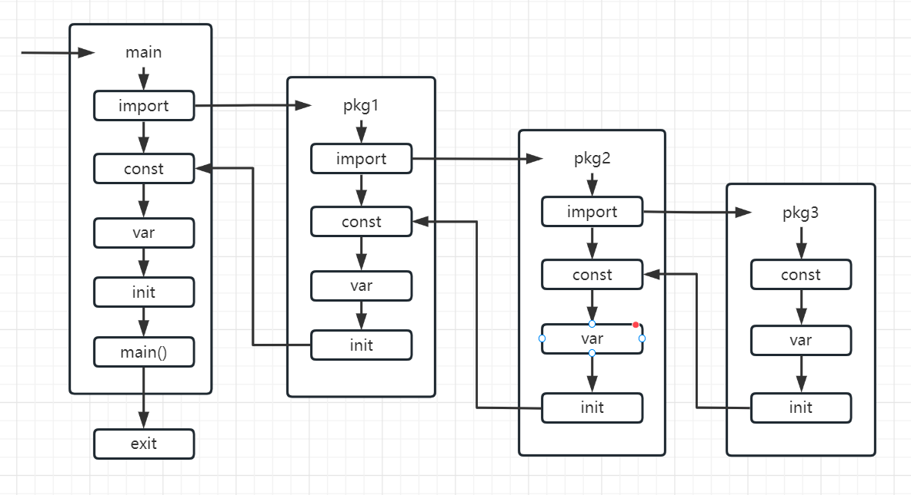

# goweb-quick-start

## 创建go项目
1. 建一个go.mod文件
```text
module 项目名

go 1.18
```
2. 然后项目根目录下执行：
```shell
go env -w GO111MODULE=on && go env -w GOPROXY=https://goproxy.cn,direct
go mod tidy
```

## 模块说明

api-模块：go gin框架：https://gin-gonic.com/zh-cn/docs/quickstart/


## 参考
[go web 工程脚手架](https://developer.aliyun.com/article/1180078)


## gorm文档
[gorm官方文档](https://gorm.io/zh_CN/docs/)

[主键-表名-字段的映射约定](https://gorm.io/zh_CN/docs/conventions.html)

### gorm理解
表名，字段名都自己写一遍，避免因一些默认约定造成不必要的麻烦，必要的路该走还得走
- 插入： s.db.Create(&student)----这里必须用指针类型
- [软删除](https://gorm.io/zh_CN/docs/delete.html#%E8%BD%AF%E5%88%A0%E9%99%A4)： 如果你的模型包含了 gorm.DeletedAt字段（该字段也被包含在gorm.Model中），那么该模型将会自动获得软删除的能力！
当调用Delete时，GORM并不会从数据库中删除该记录，而是将该记录的DeleteAt设置为当前时间，而后的一般查询方法将无法查找到此条记录。

## init执行顺序
[GO 中的 init 函数](https://blog.csdn.net/upstream480/article/details/128994361)
1. 优先级最高的是 package 加载，先层层递归进行包加载
2. 每个包中的加载顺序是：const -> var -> init

- 包含testing包的init不会被执行



## gorm会自动关闭数据库连接吗
与sql.DB句柄一样，gorm.DB对象也是可以重用的。您很少需要显式地关闭这些对象。只需创建一次并重用它即可。
gorm.DB包含一个sql.DB，它使用连接池来管理连接。如果它被关闭，它将停止接受新的查询，等待运行的查询完成，并关闭所有连接。

## 建表语句
```sql
CREATE TABLE `student` (
  `id` bigint(20) unsigned NOT NULL AUTO_INCREMENT COMMENT '主键id',
  `created_at` datetime NOT NULL DEFAULT CURRENT_TIMESTAMP COMMENT '记录创建时间',
  `updated_at` datetime NOT NULL DEFAULT CURRENT_TIMESTAMP ON UPDATE CURRENT_TIMESTAMP COMMENT '记录最后更新时间',
  `deleted_at` datetime DEFAULT NULL COMMENT '记录删除时间',
  `name` varchar(255) NOT NULL DEFAULT '' COMMENT '名字',
  `sex` varchar(255) NOT NULL DEFAULT '' COMMENT '性别',
  `age` int(11) NOT NULL DEFAULT 0 COMMENT '年龄',
  PRIMARY KEY (`id`),
  KEY `idx_updated_at` (`updated_at`) USING BTREE,
  KEY `idx_created_at` (`created_at`) USING BTREE
) ENGINE=InnoDB AUTO_INCREMENT=1 DEFAULT CHARSET=utf8mb4 COMMENT='学生表'
```

## 打印堆栈
```go
go func() {
	defer func() {
		if err := recover(); err != nil {
			s := string(debug.Stack())
			fmt.Printf("err=%v, stack=%s\n", err,  s)
		}
	}()
}
```

## 注意点
字段必须大写才能序列化成功


## 引入参数校验
go get github.com/go-playground/validator/v10
写入v8_to_v9.go
//在router.go中引入go-playground/validator参数校验
binding.Validator = new(defaultValidator)